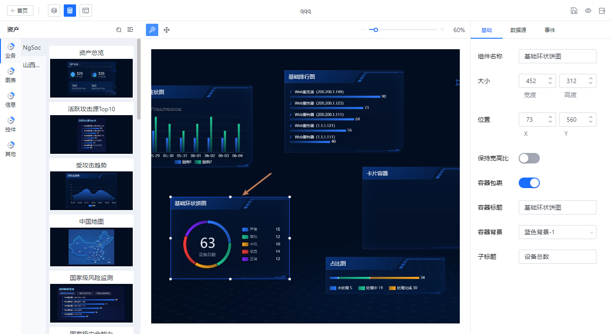

## Contents

## 背景

:::note
该场景与如下 issue 是同一个问题

https://github.com/webpack/webpack/issues/7353
:::


大屏项目需要运行时远程加载业务组件，其中业务组件 npm 包涉及一些静态资源，如背景图，字体文件。之前的处理方式是，图片，字体打包成 base64 到业务组件的 js 中。

一般情况下，组件内引用字体、图片等资源，打包为 js 文件时，直接导出资源的话，生成的 js 代码是将静态资源以相对路径的方式引用，所有的静态资源会存放到相对路径对应的文件夹中。 

这样做存在的问题是，组件打包后 js 中的相对路径是写死的，每个项目的静态资源存放路径又不一样，一旦项目的静态资源路径和组件 js 中的路径不一样，资源引用就失败了。

我们在构建业务组件库 npm 包的时候，需要考虑如何处理这些静态资源。

如下图中基础环状饼图为远程加载的业务组件，其中的蓝色背景图即为业务组件饼图所需的静态图片资源。


## 业界方案

目前业界对 npm 包中静态资源的处理一般为两种

- 所有静态资源打包成 base64 放入 js 文件中
- 让用户自行决定如何引用静态资源

他们的缺陷也都很明显
- 静态资源转 base64 后体积会大30%。且需要图片+组件渲染代码资源一起下载后，才能渲染。效果不如先加载组件渲染，后请求图片来的丝滑。
- 如 idux 的 svg 引用，需要让用户手动拷贝 svg 图片到静态资源文件夹下，再到代码中设置图标的加载函数。如果遇到业务组件库更新频繁的情况，操作上比较麻烦。
- 业务组件后续会支持外部导入。外部导入的业务组件的静态资源可能和内部业务组件静态资源重名。
- 业务组件的代码，在业务组件的目录内，业务组件的图片放在平台侧的静态文件夹下，等于在两个库分别管理图片和代码，版本管理不清晰，也容易误操作。

## 我的方案

使用`import.meta.url + new URL()`去标记资源相对位置

import.meta是**ES2020**的新规范，import.meta对象提供模块加载相关的元数据。如该模块从哪里加载的。

假设组件A的组件目录结构如下
```
componentA/
├─ index.js
├─ img.png
```

其中，index.js的代码如下
```
//若index.js从 ui.com/bigscreen/static/componentA/index.js加载，那么import.meta.url就是这个路径
//通过new URL拼装，可以实现相对路径指向
//img = ui.com/bigscreen/static/componentA/img.png
const img = new URL('./image.png', import.meta.url)
```

上述一行代码即实现了从资源相对路径指向。

这个方案比上述两个业界常见方案的优点是
- 组件文件和图片文件放在一起管理，比较清晰
- 业务方使用组件，拷贝资源到静态资源文件夹
- 业务方无需手动添加静态资源到对应目录
- 为浏览器原生语法，兼容性chrome63+


## 兼容性
- esm场景，如通过`type=module`方式加载的组件可以使用`import.meta.url`属性
如ie支持，umd方式加载的脚本，可以使用相似属性`document.currentScript.src`支持

- 上述兼容转换可通过webpack5原生、rollup插件`@web/rollup-plugin-import-meta-assets`支持。兼容esm，cjs，amd，umd，systemjs

- vite启动dev需要配置optimizedeps关闭对应npm包预构建 [issue](https://github.com/vitejs/vite/issues/8427)
- 静态资源引用声明语句必须写在顶端。即script加上马上运行的地方，不能写在setup函数等延迟执行的地方。因为`document.currentScript`对象只在对应脚本正在解析执行的时候有效。