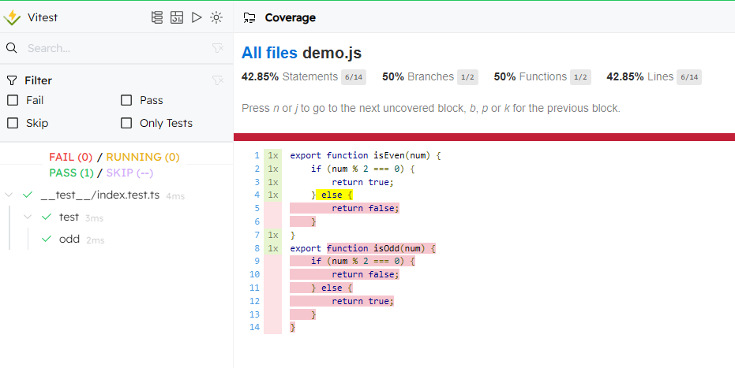
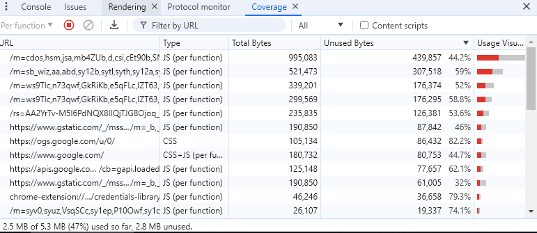

## Contents

## 什么是代码行覆盖率



代码覆盖（英语：Code coverage）是软件测试中的一种度量，描述程序中源代码被测试的比例和程度，所得比例称为**代码行覆盖率**。

它可以细分为

- 语句覆盖率 (Statements)
- 分支覆盖率 (Branches)
- 函数覆盖率 (Functions)

如上图计算结果，即为执行`isEven(10)`后的行覆盖率统计信息
- `isEven`有两个分支，代码仅执行到`num % 2 === 0`这个分支，故分支覆盖率 50%
- 共计两个函数`isEven`与`isOdd`，代码仅执行到一个行数，故函数覆盖率 50%
- 共计 14 行语句，有 6 行被执行到，故语句覆盖率 42% (不同方式计算的语句覆盖率有细微区别，如`{`,`}`花括号语句是否计算声明语句)


## 源代码插桩

大部分测试工具是基于 `istanbul` 做源代码插桩的覆盖率检测，我们来探究下 `istanbul` 的实现原理。

`istanbul`官网是这样介绍的

> `istanbul`使用行计数器来检测你的 ES5 和 ES2015+ JavaScript 代码，以便你可以跟踪单元测试对代码库的执行情况。

接下来，我们将使用`babel-plugin-istanbul`去给代码嵌入一些计数器

```
import Babel from "@babel/core";
import babelPluginIstanbul from "babel-plugin-istanbul";

const output = Babel.transform(`
export function isEven(num) {
  if (num % 2 === 0) {
    return true;
  } else {
    return false;
  }
}
isEven(10);
  `, {
  plugins: [babelPluginIstanbul],
  filename:  'demo.js'
}).code;

console.log(output);
```

上述代码执行后，我们获得了插桩代码（简化版，增加可读性）
```
var coverageData = {
  // 每个语句对应的原生代码块信息，这里省略
  statementMap: {
    0: {
      start: {
        line: 2,
        column: 2,
      },
      end: {
        line: 6,
        column: 3,
      },
    },
  // ...
  // 省略其他 loc 信息
  },
  // 声明语句有 4 行
  s: {
    0: 0,
    1: 0,
    2: 0,
    3: 0,
  },
  // 有 1 个函数声明
  f: {
    0: 0,
  },
  // 有 2 个分支声明
  b: {
    0: [0, 0],
  },
};
function isEven(num) {
  coverageData.f[0]++;
  coverageData.s[0]++;
  if (num % 2 === 0) {
    coverageData.b[0][0]++;
    coverageData.s[1]++;
    return true;
  } else {
    coverageData.b[0][1]++;
    coverageData.s[2]++;
    return false;
  }
}
coverageData.s[3]++;
isEven(10);
```

我们可以看到，`coverageData`中的`s`,`f`,`b`分别对应之前的`Statements`,`Functions`,`Branches`.

即`istanbul`通过一个`babel`插件

1. 先将源代码解析成`AST`
2. 遍历`AST`节点，找到所有的函数声明节点、分支声明节点、语句声明节点，统计节点个数。提前做好数组初始化，生成原始 0 计数的`coverageData`
3. 进行`AST`转换
    1.  在`AST`的函数声明节点内，插入对应序号的`Functions`计数器
    2.  在`AST`的分支声明节点内，插入对应序号的`Branches`计数器
    3.  在`AST`的语句声明节点内，插入对应序号的`Statements`计数器
4. 将`AST`序列化成插桩代码
5. 执行上述插桩代码，若程序执行到某处，则会触发对应行的计数器++，未执行到的代码块对应的计数器数值则保持不变
6. 最终可根据`coverageData`中对应记录 1 或者以上的数值，除以全部计数器个数，获得对应覆盖率计算结果。
7. 每个语句对应源代码的`loc`位置信息，反应到对应的可视化面板展示

## v8字节码插桩

字节码插桩与源代码插桩类似，只不过是在v8对`javascript`编译生成的`native code`二进制码的部分插入对应计数器完成计数工作。



图例为访问`google.com`页面进行的代码覆盖率检测。`google.com`首页加载了总计`5.3mb`的`css`和`javascript`资源，其中`2.5mb`的资源代码被执行到。

我们发现，字节码插桩比源码插桩覆盖面更广，除了支持`javascript`之外，还能支持`css`

> 图例的 coverage 面板位于 F12 开发者工具 -> 右上角三个点更多 -> more tools -> coverage

v8提供了手动调用`JavaScript`字节码覆盖率计算，步骤为

- `Profiler.startPreciseCoverage()` 启用覆盖率收集，可选择进行调用计数（与二进制覆盖率相比）和块粒度（与函数粒度相比）；
- `Profiler.stopPreciseCoverage()` 禁用收集并释放相关数据结构。
- `Profiler.takePreciseCoverage()` 将收集到的覆盖率信息作为源范围列表以及相关的执行计数返回

上述可以获得一串`json`结果，交由`v8-to-istanbul`可将结果类型转换为上述`istanbul`源码插桩一致的数据格式，并使用相同的UI进行展示结果。


v8字节码插桩参考实现 -- 代码节选自`@vitest/coverage-v8`
```
import inspector from 'node:inspector';
import { provider } from 'std-env';

const session = new inspector.Session();
function startCoverage() {
  session.connect();
  session.post("Profiler.enable");
  session.post("Profiler.startPreciseCoverage", {
    callCount: true,
    detailed: true
  });
}
async function takeCoverage() {
  return new Promise((resolve, reject) => {
    session.post("Profiler.takePreciseCoverage", async (error, coverage) => {
      if (error) {
        return reject(error);
      }
      const result = coverage.result.filter(filterResult);
      resolve({ result });
    });
  });
}
function stopCoverage() {
  session.post("Profiler.stopPreciseCoverage");
  session.post("Profiler.disable");
  session.disconnect();
}
```

## 特殊语法

在实际业务场景中，有很多分支是不会被执行到的，只是代码实现预留，这些场景也被计算为未覆盖有些不合理。
```
function getGenderChinese(gender){
   if(gender === 'male'){
      return '男'
   }
   if(gender === 'female'){
      return '女'
   }
   // 假设所有数据都至多有上述两种 gender，那么这个 return 语句一直不会被执行到
   // 行覆盖率就会提示这个语句未执行
   return '未知'
}
```

`istanbul`与`v8`均提供了对应的注释语法来修正（逃避）检测
```
/* istanbul ignore if */
/* v8 ignore next */
/* v8 ignore next 3 */
```
不过这些语法注释语法在`vitest`中并不会生效，因为`vitest`使用`esbuild`将`ts`转换为`js`再进行插桩，但是`esbuild`在转码的过程中，会丢弃所有注释，导致`ignore`语法不生效.且 `esbuild`并不打算未来对其支持 [issue](https://github.com/evanw/esbuild/issues/516) 

唯一的方法就是加上`@preserve`语法`/* istanbul ignore file -- @preserve */`，使得`esbuild`保留该出注释。但是这样缺点也很明显，即这段注释会生成到最终的产物代码中。

## 参考资料

- https://istanbul.js.org/
- https://v8.dev/blog/javascript-code-coverage
- https://chromedevtools.github.io/devtools-protocol/tot/Profiler/#method-startPreciseCoverage