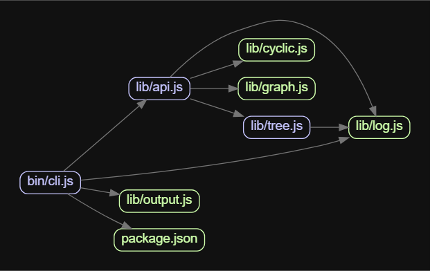

## Contents

## 前言
大项目规矩实在太多了，修 `bug` 需要详细描述问题根因，如何解决，测试步骤，影响范围，是否自测。经常上库几行代码，上库描述信息要写**半小时**。

其中，前端对于其他页面的影响是这样规定的。

- 如果修改了`common_components`中的全局组件，则需要对**所有引用到组件的页面**进行测试，并列出所有影响到的页面给到测试
- 如果仅修改了某个页面的内容，则需测试对应页面

项目的目录结构大致如下

```pre
src/
├── common_components/
│   ├── global_component1.js
│   └── global_component2.js
└── pages/
    ├── page1/
    │   ├── index.js
    │   ├── local_component1.js
    │   └── local_component2.js
    └── page2/
        ├── index.js
        ├── local_component3.js
        └── local_component4.js
```


## 问题

- 如果一些全局组件的被引用页面比较多，人工查询会非常耗时，而且容易漏
- 随着页面的上线/下线，有些全局组件，实际上只有1处引用，没有全局组件的含义了。那么开发人员和审核人员不用费时费力找引用关系了
- 有些开发不守规矩，本地组件也存在全局组件类似的功能，比如 `page1` 页面下使用了 `page2` 目录中的 `local_component` 组件

## 思考

由于代码比较统一，都是用 `CommonJS` 处理的模块引用关系，想写一个工具处理这些引用分析，自动输出修改测试建议

经过一番搜索，了解到有一个叫[madge](https://github.com/pahen/madge)的工具，可以自动分析 `CJS` 和 `ESM` 的文件引用关系



直接进行 `API` 调用的话，可以得到一个一维数组的文件直接引用关系
```
{
  "src/pages/page1/index.js": [
    "src/pages/page1/local_component1.js",
    "src/pages/page1/local_component2.js",
    "src/common_components/global_component1.js"
  ],
  "src/pages/page1/index.js": [
    "src/pages/page1/local_component3.js",
    "src/pages/page1/local_component4.js"
  ]
}

```

我们吧这里的样式文件（css，less）去掉，再把这个一维数组组装成引用链，深度1的节点为直接引用，深度2的节点以下的链则为间接引用

这样，从一个或多个改动的文件，可以定位到最终影响的某个路由页面。

那么，根据项目的路由表，做出引用链终点数组，如果引用链索引到上述的某个路由文件，则输出对应的路由名称

则每个改动文件可以对应到如下三种情况

- 找到找到一个或多个最终路由目录
- 没有文件引用该文件，或者该文件最终没有被路由引用可能是这个文件是项目的冗余文件，或者路由入口被暂时注释导致
- 出现循环引用，中止递归待排查

优点： 
1. 在流水线上做改动，不影响原来任何功能。
2. 自动化部分功能。由以前的提交人自行描述改动分析改为自动化分析改动影响面。节省了人员时间。
3. 不限制代码语言、代码仓。如需在其他产品线引入功能。仅需修改输出路由表函数即可。

缺点：
1. 自动化程度不足。只有部分自动化。输出的是程序分析的改动影响路由。具体如何影响，还是需要人工判断。
2. 存在无法检测到的场景。如`EXT`，`windows`等全局变量的使用。那么无法确定影响面。
3. 存在无法检测到的场景，如动态引用，`require(var)`, `require.context()`。那么无法识别到当前文件的完整引用关系数据。
4. 粒度粗。思考能否以函数、变量为维度去分析改动影响面。插桩？istanbul？