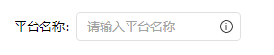
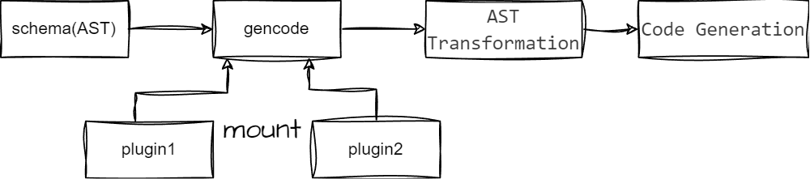
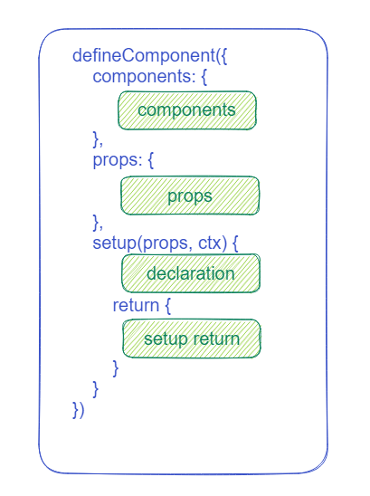
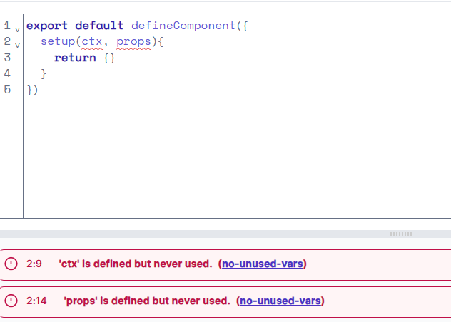
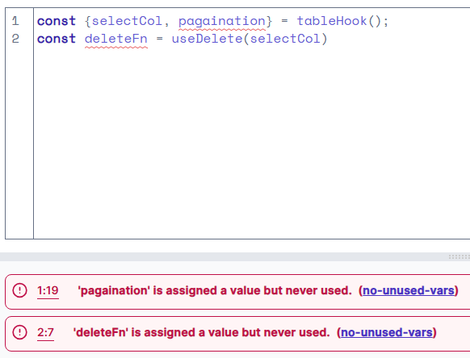
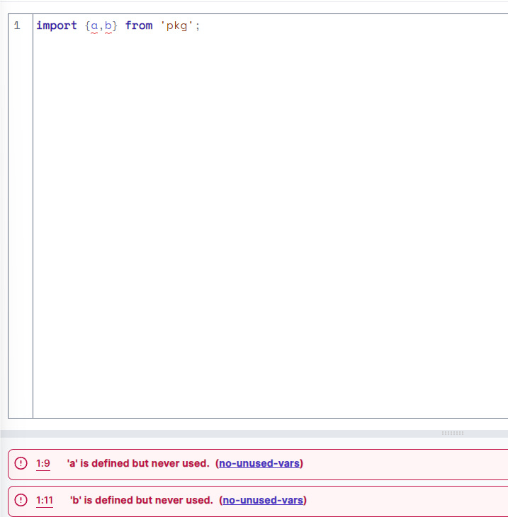

## Contents

## 前言

最近，团队做了个视觉稿生成代码的工具。这个工具可以一键将 [mastergo平台](https://mastergo.com/) 设计稿平台的设计稿变成可用代码。与 mastergo 平台的开发人员对接的时候，他们都表示功能比他们自己的 d2c 还要好，笑。

整体工作流程是这样的

1. 用户打开设计稿，选定节点，点击浏览器插件，选择代码生成
2. 浏览器插件通过设计稿对应的 API 获取选中的节点信息传递至服务器
3. 服务器根据节点信息以及图像特征处理成初步图元信息树，返回 url 链接给浏览器插件
4. 浏览器插件打开 url，用户修改识别错误的节点名称、层级、属性，发送最终图元信息树给服务器
5. 服务器根据最终图元信息树，返回代码片段
6. `monaco-editor`组件展示最终代码，`vue-repl`组件展示代码运行效果

本文将介绍怎么由图元信息生成可用前端代码。

## 了解需求

我司的业务以B端场景为主，基本上每个页面都需要长期维护。所以期望生成代码的风格必须和项目风格是类似的

但是同一个视觉稿，简单的弹窗功能，在不同的写法、组件库下，最终的代码差异极大


### vue class component 写法

```
<template>
    <sf-form class="modal-form" ref="form" label-width="auto" input-width="auto">
        <sf-form-item tip-text="" :label-text="$i('标签名称')">
            <sf-input
                :input-width="326"
                :placeholder="$i('请输入模板名称')"
                name="value"
                v-model="form.tagName"
                v-model.number="value"
            ></sf-input>
        </sf-form-item>
        <sf-form-item tip-text="" :label-text="$i('自定义名称')">
            <sf-input
                :input-width="326"
                :placeholder="$i('请输入描述（选填）')"
                name="value"
                v-model="form.customName"
                v-model.number="value"
            ></sf-input>
        </sf-form-item>
        <sf-form-item tip-text="" :label-text="$i('启用标签')">
            <div class="ccode_alignItem__center ccode_justify__end form-formItem__toolbar">
                <div class="form-formItem__toolbar--round"></div>
            </div>
        </sf-form-item>
    </sf-form>
</template>
<script lang="ts">
import { Vue, Component, Mixins } from 'vue-property-decorator';
import { $i } from 'mss/i18n';
import FormMixin from 'module/mod-common/form/index';

@Component
export default class MyComponent extends Mixins(FormMixin) {
    value = 1;

    private form = { tagName: '', customName: '' };
}
</script>
```

### define component 写法

```
<template>
    <div class="pageContainer">
        <IxHeader>
            <IxRow justify="space-between" align="center" :wrap="false" class="header-row">
                <IxCol class="row-col">
                    <span class="row-col">
                        {{ $i('production.module.add_search_condition') }}
                    </span>
                </IxCol>
                <IxCol flex="30px" class="comp-image"></IxCol>
            </IxRow>
        </IxHeader>
        <IxSpace :wrap="false" vertical :size="44" align="center" class="space-content">
            <IxForm :colonless="false" :labelCol="6" class="space-form" :control="formGroup">
                <IxFormItem :label="$i('production.module.label_name')">
                    <IxInput :placeholder="$i('production.module.enter_template_name')" control="tagName"></IxInput>
                </IxFormItem>
                <IxFormItem :label="$i('production.module.custom_name')">
                    <IxInput
                        :placeholder="$i('production.module.enter_description_optional')"
                        control="customName"
                    ></IxInput>
                </IxFormItem>
                <IxFormItem :label="$i('production.module.enable_label')">
                    <div class="ccode_alignItem__center ccode_justify__end form-formItem__toolbar">
                        <div class="form-formItem__toolbar--round"></div>
                    </div>
                </IxFormItem>
            </IxForm>
            <IxSpace :wrap="false" block justify="end" class="space-space">
                <IxButton size="md">
                    {{ $i('global.ok.button') }}
                </IxButton>
                <IxButton size="md">
                    {{ $i('global.cancel.button') }}
                </IxButton>
            </IxSpace>
        </IxSpace>
    </div>
</template>

<script lang="ts">
import { name } from 'appLib/utils/validations/regexpIdux/name';
import { Validators, useFormGroup } from '@idux-vue2/cdk/forms';
import { defineComponent } from '@vue/composition-api';

export interface FormGroupType {
    tagName: string;
    customName: string;
}

export default defineComponent({
    setup(props, ctx) {
        const { maxLength } = Validators;

        const formGroup = useFormGroup<FormGroupType>({
            tagName: ['', [name, maxLength(95)]],
            customName: ['', maxLength(95)],
        });

        return {
            state,
            formGroup,
        };
    },
});
</script>
```

### vue script setup 写法

```
<template>
    <div>
        <IxHeader>
            <IxRow justify="space-between" align="center" :wrap="false">
                <IxCol>
                    <span> 新增检索条件 </span>
                </IxCol>
                <IxCol flex="30px"></IxCol>
            </IxRow>
        </IxHeader>
        <IxSpace :wrap="false" vertical :size="44" align="center">
            <IxForm :colonless="false" :labelCol="6" :control="formGroup">
                <IxFormItem label="标签名称">
                    <IxInput placeholder="请输入模板名称" control="tagName"></IxInput>
                </IxFormItem>
                <IxFormItem label="自定义名称">
                    <IxInput placeholder="请输入描述（选填）" control="customName"></IxInput>
                </IxFormItem>
                <IxFormItem label="启用标签">
                    <div>
                        <div></div>
                    </div>
                </IxFormItem>
            </IxForm>
            <IxSpace :wrap="false" block justify="end">
                <IxButton size="md"> 确定 </IxButton>
                <IxButton size="md"> 取消 </IxButton>
            </IxSpace>
        </IxSpace>
    </div>
</template>

<script lang="ts" setup>
import { Validators, useFormGroup } from '@idux/cdk/forms';

export interface FormGroup {
    tagName: string;
    customName: string;
}

const formGroup = useFormGroup<FormGroup>({
    tagName: ['', Validators.maxLength(95)],
    customName: ['', Validators.maxLength(95)],
});
</script>
```


### 上游输入

举个最简单的例子，例如这个的输入框：



扫描后可以得到下面的类似`VNode`的 `schema`：

```
{
    "component": "IxForm",
    "props": {
        "labelCol": 4,
    },
    "children": [
        {
            "component": "IxFormItem",
            "props": {
                "label": {
                    "type": "i18n",
                    "key": "i18n_key.platform_name",
                    "value": "平台名称",
                },
                "colonless": false,
            },
            "children": [
                {
                    "component": "IxInput",
                    "props": {
                        "placeholder": {
                            "type": "i18n",
                            "key": "i18n_key.input_placeholder",
                            "value": "请输入平台名称",
                        },
                    },
                    "slots": {
                        "suffix": [
                            {
                                "component": "IxIcon",
                                "props": {
                                    "name": "info-circle"
                                }
                            },
                        ],
                    },
                }
            ]
        }
    ]
}
```


## Babel 简介

Babel 是一个 JavaScript 编译器，主要用于将现代 JavaScript 代码（如 ES6、ES7 等）转换为兼容较旧浏览器和环境的 JavaScript 代码。它的工作流程包括以下几个步骤：

1. **解析（Parsing）**：
   - **词法分析（Lexical Analysis）**：将输入的代码字符串转换为一个个词法单元（token），每个词法单元代表一个最小的语法元素，如关键字、变量名、操作符等。
   - **语法分析（Syntax Analysis）**：将词法单元序列转换为一个抽象语法树（AST）。AST 是一个树状结构，表示代码的语法结构。

2. **转换（Transformation）**：
   - **遍历和修改 AST**：对 AST 进行遍历，并根据需要进行修改。这个过程包括各种转换插件（plugins）的执行，每个插件负责一个特定的转换任务，如将箭头函数转换为普通函数，将类语法转换为函数构造等。

3. **生成（Generation）**：
   - **代码生成（Code Generation）**：将修改后的 AST 转换回代码字符串，同时生成源映射（source map），以便在调试时能将转换后的代码映射回原始代码。

### Babel 工作流程图

```plaintext
 +--------------+       +--------------+       +--------------+
 |              |       |              |       |              |
 |   Source     |       |   AST        |       |   Transformed|
 |   Code       | ----> |   Generation | ----> |   AST        |
 |              |       |              |       |              |
 +--------------+       +--------------+       +--------------+
                                |
                                |
                                V
                        +--------------+
                        |              |
                        |   Code       |
                        |   Generation |
                        |              |
                        +--------------+
```

## 仿 Babel 流程生成代码

我们要做的工具和`babel`十分类似

- `babel`是将一种`语言`转换为另一种`目标语言`
- `视觉稿转代码`是将`设计稿语言`转换为`实际业务代码`
- `babel`与`视觉稿转代码`都需要支持装载插件定义转换流程，指定编译目标`target`，生成任意`目标语言代码`

由于上游的输入就是 AST 了，不需要再进行解析流程

我们设计一个这样的机制，插件可以在每个节点遍历的回调钩子中修改节点信息，以及以字符串形式往区块添加



### 遍历节点 AST Transformation

我们对`schema`中的每个 AST 节点进行遍历，在遍历的过程中，给节点绑定不同的属性以及事件，不同组件库则处理成不同组件名

遍历规则参考[@babel/traverse](https://github.com/babel/babel/tree/main/packages/babel-traverse)，回调方式参考`babel`。

同时，支持在遍历的过程中对节点进行删除、移动、添加、修改，**遍历器会保证每个节点恰好被遍历一次**
 


### 代码生成 Code Generation

#### vue template

`schema`节点与`html`节点均为 1: 1的对应关系，借助开源工具[posthtml](https://github.com/posthtml/posthtml)，仅需处理一下格式转换，即可直接序列化成`html`字符串

```
<template>
   {{ posthtml(schemaToHtmlTag(schema)) }}
</template>
```

#### vue script

我们对于每个文件，可以指定一个文件区块，比如`defineComponent`样式的`vue script`，我们指定如下四个区块，在插件定义的遍历函数钩子中，可以往如下区块**以字符串形式**添加代码。亦可存储特征信息到全局`Context`，待完成遍历后一次性将特征信息**以字符串形式**序列化添加到如下区块中。以此来完成代码生成。




#### 其他文件

诸如`ts`,`i18n.yml`,`css`此类文件，则和上述`vue script`的处理方式一致，

### 编写插件
```
import { type GenCodePlugin, type VueHelper } from 'gencode-transform';

function formPlugin(): GenCodePlugin {
    return {

        // 约定：插件拥有唯一 name
        name: 'gcode-plugin-form',
        resolve(mod, ctx) {

            // 本插件只处理 vue 模块
            if (mod.ext !== 'vue' || !mod.schema) {
                return;
            }

            // 获取协助代码生成的 helper
            const helper = ctx.getHelper<VueHelper>(mod);

            // 遍历 schema
            ctx.traverse(mod.schema, {

                /**
                 * 收集用到的组件，例如 IxForm 等；
                 * 将其放入 helper 的 importer 中，生成引入代码，如：
                 *
                 * import { IxForm, IxFormItem } from '@idux-vue2';
                 */
                enter(path) {
                    if (/^Ix.+/.test(path.type)) {
                        helper.options.components.add(path.type);
                        helper.importer.add({
                            imported: path.type,
                            from: '@idux-vue2',
                        });
                    }
                },

                /**
                 * 收集 i18n 信息，生成 i18n 词条文件
                 */
                exit(path) {
                    const props = path.schema.props ?? {};
                    const rawProps = path.raw?.props ?? props;
                    Object.keys(props)?.forEach(propKey => {
                        if (props[propKey]?.type === 'i18n') {
                            ctx.i18n.add(
                                rawProps[propKey].key,
                                rawProps[propKey].value,
                            );
                            path.propsBind(propKey, `$i('${props[propKey].key}')`);
                        }
                    });
                },

                // 专门访问 IxForm 组件，设置 class name
                IxForm(path) {
                    // path.schema.props.class = 'wrapper';
                    path.propsSet('class', 'wrapper');
                },
            });

            // 生成 setup 代码
            helper.setup = true;

            // 写入简单的样式代码
            helper.style.lang = 'css';
            helper.style.code = `
                .wrapper {
                    height: 100%;
                }
            `;
        },
    };
}
```

### 效果示例

根据上面的 schema 和插件，我们会得到下面的结果：

```
[
    {
        "ext": "vue",
        "filename": "index.vue",
        "code": "..."
    },
    {
        "ext": "yaml",
        "filename": "i18n.yaml",
        "code": "..."
    }
]
```

其中 vue 的代码如下:

```
<template>
    <IxForm class="wrapper" :labelCol="4">
        <IxFormItem :colonless="false" :label="$i('i18n_key.platform_name')">
            <IxInput :placeholder="$i('i18n_key.input_placeholder')">
                <template #suffix>
                    <IxIcon name="info-circle" />
                </template>
            </IxInput>
        </IxFormItem>
    </IxForm>
</template>

<script lang="ts" setup>
import { IxForm, IxFormItem, IxInput, IxIcon } from '@idux-vue2';
</script>

<style lang="css">
.wrapper {
    height: 100%;
}
</style>
```
i18n 词条文件如下：

```
"i18n_key.platform_name": "平台名称"
"i18n_key.input_placeholder": "请输入平台名称"
```


## 生成代码优化

使用 d2c 生成的代码，复制到项目中，有 `eslint` 报错。落地场景约生成 250 行 vue 代码，有13 `eslint` 报错。 业务人员反馈，吧生成出来的代码改到不报错，功能正常，和去项目模块 copy 相似代码后再进行修改，提效不明显。 使用我们内部工具生成出来代码一堆报错，在落地的时候会有很大的阻碍，业务人员会质疑我们工具不好用！心理上就会抵触使用。 

### eslint 问题分析

> 多余函数变量声明



> hook解构多余变量



> 导入变量未使用



其中，声明变量未使用约占全部 `eslint` 问题数量的 70%

为什么不在插件侧按需声明变量呢？因为这样会使得代码的按需声明变得很复杂。变量声明有嵌套关系。

举个例子，为了使得插件的编写简单，我们一般检测到存在`table`场景，则自动注入全部`table`场景相关的业务代码。
```
if (视觉稿存在表格) {
    以字符串形式往 script 部分
    注入 分页逻辑
    注入 排序、筛选变化重新请求逻辑
    注入 勾选列和删除联动逻辑
    ...
}
```

在 hook解构多余变量 场景中，如果视觉稿中没有涉及删除的操作，那么`deleteFn`就无需生成，往上的`selectCol`变量也无需生成，若也没用到分页器组件，则`page`分页器变量也无需声明，且`tableHook`的声明以及他的`import`导入可能都是多余的。

如果需要精细化的判断，那么`if`语句会非常多非常复杂，还是尽量用工具自动化处理这些

### eslint autofix

https://eslint.org/docs/latest/rules/no-unused-vars

官方有规则报错，但是没有自动修复，所以需要人工写一个 fixer 规则去自动删除无用变量