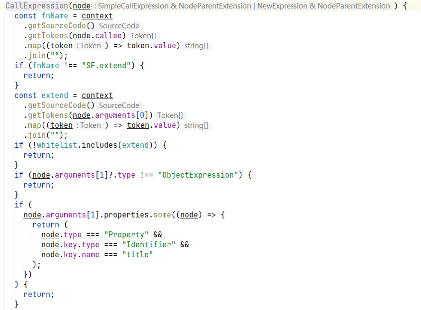

## Contents

## 快乐划水

今天上班划水，看到一个很有意思的文章[我点了页面上的元素，VSCode 乖乖打开了对应的组件？原理揭秘。](https://juejin.cn/post/6901466406823575560)

虽然`vue-dev-tools`早就支持这个功能，但是看到这个`react`版本的实现的细节，我才知道原理，简单概况一下

1. 在编译的过程中，`babel` 解析 `ast`，遇到 `JSXOpeningElement` 这个 `node` 的 `type` 的时候，注入当前源码行、列、文件到节点信息`fiber node`
2. 外部通过 `chrome插件` 或者 用户代码注入一个事件，用户手动触发点击节点，从用户点击的节点中查找*步骤1*中注入的信息，如果找到了，那么往本机发送一个请求
3. 本机启动一个服务。用于接受上述*步骤2*发来的请求。当接受到请求的时候，监测本机常用的 `IDE` 进程是否打开，调用系统命令打开对应 `IDE` ，若都没找到则 fallback 记事本打开

:::NOTE 
吐槽一下，我测试的时候怎么经常 fallback 到记事本打开，我 IDE 开着呢
:::

## 简单实现

现在项目中用的都是`Ext`，老东西是没有 `dev-tools` 的，找页面代码也是十分痛苦，我也准备搞一个自己的 `ext-dev-tool` 插件

整体流程与上述类似

1. `dev` 场景，在 `babel` 编译的过程中，遇到 `new` 组件的声明语句的时候、遇到 `xtype` 节点声明的时候，注入当前源码行、列、文件到节点信息
2. 用户触发 `dev-tool` 查询，使用`closest()`定位到最近的元素，通过`Ext.get(id)`获得组件实例
3. 在实例上查找1中注入的源码位置信息，若没有查到，则查询当前节点的父节点，直到父节点是 `body` 为止
4. 在 `webpack devserver` 接受上述3发送来的源码位置信息，调用命令行使用 `websotrm` 打开文件

> `webstorm64.exe [--line <number>] [--column <number>] <path ...>`

咱们的组件声明场景大致如下

简单的注入 `babel` 插件实现

至于`dev server` 接受请求自动打开 IDE，适配不同 IDE 命令行的文件、loc位置信息传参，直接抄 [vite源码实现](https://github.com/yyx990803/launch-editor)，真是方便，感谢yyx

实测，最终大概有 70% 的节点可以被注入源码信息，剩下 30% 的节点创造语句太复杂了，就不注入了。。。