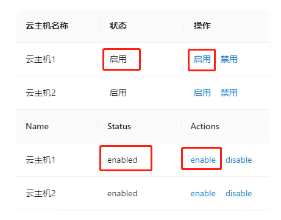
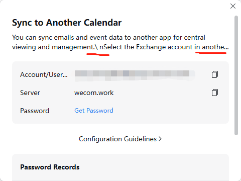

## Contents

## 简介

国际化通常被写为“i18n”（18 是英文单词 Internationalization 中“i”和“n”之间的字母数），是指采用特定实践来设计和开发应用程序，以便简化针对不同国家/地区、语言和文化的本地化工作。

> 项目中文本部分是这样进行 `i18n` 翻译的

1. 将所有文本、标点符号，嵌套为国际化翻译函数，如`const enableText = $i('启用')`
2. 使用`CLI`命令行工具，工具基于`AST`语法分析，提取所有被国际化函数包裹的词条，如上述中的`启用`文本会被提取
3. 将需要翻译的词条提供给翻译人员进行翻译，得到`json`词条对照表，如`const en_us = {"启用": "enable"}`
4. 运行时翻译函数将对应文本根据语言环境信息翻译到对应语言

:::important
本文国际化标准来自于 [ICU Message](https://unicode-org.github.io/icu/userguide/format_parse/messages/)

Chrome, macOS, iOS等产品均采用此标准
:::


## 词条与代码耦合

初期为了便捷编码，直接采用**中文key**当作语言的词条。这个做法最大的问题在于更新文案需要重新构建。

举个例子，假设产品需要将内置的策略名称显示，从**内置策略**改为**默认策略**，即修改代码文件

`const policyName = $i('内置策略')` 

to

`const policyName = $i('默认策略')`

再重新构建修改词条包方可上线。这样使得词条与代码耦合。

基于此场景，我们引入了 ICU 规范，剥离词条信息与代码文件。我们将**key**从**中文**换成**id**

```
const policyName = $i('cloudproduct.moudlesA.pageA.default_policy_name')

词条文件
cloudproduct.moudlesA.pageA.default_policy_name = 默认策略
```

不过这种做法的缺点也是相当明显的（研发效能负提升，研发，翻译协作效能提升，国际化支持程度好）

- 页面多的情况下，根据中文词条找代码位置很麻烦，因为只能搜到词条文件，然后再用词条信息去搜索代码
- 代码文件里面没有中文，有时候看到代码不知道是干嘛的
- 开发人员要给每个词条，想一个有语义化的词条名


## 单复数

> 什么是复数问题？动态数量关系带来语言单复数问题。

英语具有较好的语法容错，单复数例子较为简单，如下：

- `你的学生有1支新铅笔。` ==> `Your student has 1 new pencil.`
- `你的学生有2支新铅笔。` ==> `Your student has 2 new pencils.`


下面是法语的单复数例子（以法语为代表的印欧语系中，名词的单数和复数形式的阴阳性不一样，随之修饰的冠词、形容词的阴阳性也需要保持一致）：

- `你的学生有1支新铅笔。` ==> `Votre élève a un nouveau crayon.`
- `你的学生有2支新铅笔。` ==> `Votre élève a deux nouveaux crayons.`


复数词条必须使用一种国际通用的标准文本格式，该语法格式为 Unicode 基金会维护的 [ICU Message](https://unicode-org.github.io/icu/userguide/format_parse/messages/)，可以跨编程语言使用，其遵循 [CLDR](http://cldr.unicode.org/index) 定义的多语言复数规则。

:::note
根据 CLDR 复数规则，中文并没有单复数问题。
:::

### 单变量

词条如下：

```
select = 'select {count, plural, one {one message} other {# messages}}.',
```

模板如下：

```html
<p>{{ $i('select', { count: 0 }) }}</p>
<p>{{ $i('select', { count: 1 }) }}</p>
<p>{{ $i('select', { count: 2 }) }}</p>
```

输出如下：

```html
<p>select 0 messages.</p>
<p>select one message.</p>
<p>select 2 messages.</p>
```

### 多变量

其实多变量和单变量是一样的，并没什么区别。

词条如下：


```
fruit =  
      {name}, you have { numPears, plural, 
        one {one pear} 
        other {# pears}
      }, I have { numApples, plural,
        one {one apple} 
        other {# apples}
      }.
```

模板如下：

```html
<p>{{ $i('fruit', { name: 'Jack', numPears: 0, numApples: 0 }) }}</p>
<p>{{ $i('fruit', { name: 'Lucy', numPears: 1, numApples: 1 }) }}</p>
<p>{{ $i('fruit', { name: 'David', numPears: 2, numApples: 2 }) }}</p>
```


输出如下：

```html
<p>Jack, you have 0 pears, I have 0 apples.</p>
<p>Lucy, you have one pear, I have one apple.</p>
<p>David, you have 2 pears, I have 2 apples.</p>
```

## 上下文语境

### 一词多义

:::note
相同中文，对应的译文会有差别。
:::



在国际化过程中，一词多义的现象往往会带来翻译和理解上的挑战。例如，中文的“启用”在翻译成英文时，可以对应为“enable”或“enabled”，但两者表达的意义有所不同。

- enable: 作为动词，表示执行“启用”这一动作。即图中操作栏动作对应的译文
- enabled: 作为形容词，表示“启用”的状态。即图中状栏对应的译文

因此，在国际化过程中，准确区分“启用”在不同语境下的含义，选择恰当的翻译方式，能够帮助用户更好地理解并使用产品功能。

### 阅读习惯

:::note
对于英文排版，符号（如半角逗号，半角句号）数字，后面都是会跟上一个空格的。中文符号（如全角逗号，全角句号）后面一般不会有空格。
:::

> Safety starts with understanding how developers collect and share your data. Data privacy and security practices may vary based on your use, region, and age. The developer provided this information and may update it over time.

如果英文符号之间没有空格，那么阅读效果会很差

> Safety starts with understanding how developers collect and share your data.Data privacy and security practices may vary based on your use,region,and age.The developer provided this information and may update it over time.

## 转义


> 截取至 [google about](https://about.google/)

上述语句需要国际化，其中麻烦的点在于一句话中有好几个单词的颜色是不同的。处理方式有下面几种。

### 词条拼接

```
<p>
    <span class="part1">{$i('part1')}</span>
    <span class="part2">{$i('part2')}</span>
    <span class="part3">{$i('part3')}</span>
    <span class="part3">{$i('part4')}</span>
    <span class="part3">{$i('part5')}</span>
    <span class="part3">{$i('part6')}</span>
    <span class="part3">{$i('part7')}</span>
    <span class="part3">{$i('part8')}</span>
</p>

// 词条文件
part1 = Our mission is to
part2 = organise
part3 = the world’s
part4 = information
part5 = and make it
part6 = universally accessible
part7 = and
part8 = useful.
```

这种方式有一些弊端
1. 词条之间互相没有关联性，单词翻译是ok的，如果合成一个句子，很可能有语法错误
2. 词条可维护性很差


### 词条嵌入html代码

```
<p>
    { $i('about.google') }
</p>

// 词条文件
about.google = <span>Our mission is to</span> <span style="color:red">organise</span> <span>the world’s</span>
```

这种方式弊端更明显
1. 翻译人员在翻译的过程中如果不小心修改了`html`代码，十分容易出现渲染失败。
2. 词条中涉及html代码，还会涉及解析、转义、xss等问题。
3. 词条可维护性很差



> 企业微信英文版错误处理的转义字符

### 翻译插值

为了解决上述场景，我们研发了一个翻译插值组件

```
<i18n-intl key="about.google" tag="p">
    <template #part1>
        <span class="part1">$i('part1')</span>
    </template>

    <template #part2>
        <span class="part2">$i('part2')</span>
    </template>

    <template #part3>
        <span class="part3">$i('part3')</span>
    </template>

    <template #part4>
        <span class="part4">$i('part4')</span>
    </template>

    <template #part5>
        <span class="part5">$i('part6')</span>
    </template>

    <template #part8>
        <span class="part8">$i('part8')</span>
    </template>
</i18n-intl>


// 词条文件
about.google = {part1}{part2}{part3}{part4}{part5}{part6}{part7}{part8}
part1 = Our mission is to
part2 = organise
part3 = the world’s
part4 = information
part5 = and make it
part6 = universally accessible
part7 = and
part8 = useful.
```

> 实际运行效果与词条嵌入html场景一致

- 词条之间有关联性，单词翻译是ok的，句子翻译ok，可维护性好
- 词条不涉及html内容，翻译只需关注内容，无需在意表现形式
