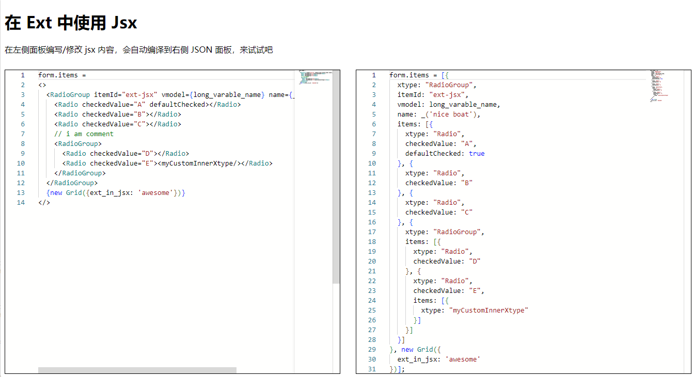

## Contents

## 前言

Ext 这个框架真的不好用。。。

平常就是用一大串 `json` 去渲染一个表单，`json` 这个格式对人实在不友好，只要内容一多，马上眼花缭乱

比如一个简单的 `radiogroup` 的声明 `json` 如下。眼睛都要看花了

```
form.items = [{
  xtype: "RadioGroup",
  itemId: "ext-jsx",
  vmodel: long_varable_name,
  name: _('nice boat'),
  items: [{
    xtype: "Radio",
    checkedValue: "A",
    defaultChecked: true
  }, {
    xtype: "Radio",
    checkedValue: "B"
  }, {
    xtype: "Radio",
    checkedValue: "C"
  }, {
    xtype: "RadioGroup",
    items: [{
      xtype: "Radio",
      checkedValue: "D"
    }, {
      xtype: "Radio",
      checkedValue: "E",
      items: [{
        xtype: "myCustomInnerXtype"
      }]
    }]
  }]
}, new Grid({
  ext_in_jsx: 'awesome'
})];
```

上一份工作用的是 `react`，我还是觉得类 `html` 的语言同来描述页面最适合不过了

如果上述的 `json` 用 `jsx` 语法来描述的话，只需要 14 行，瞬间少了一半多有没有

```
form.items =
<>
  <RadioGroup itemId="ext-jsx" vmodel={long_varable_name} name={_('nice boat')}>
    <Radio checkedValue="A" defaultChecked></Radio>
    <Radio checkedValue="B"></Radio>
    <Radio checkedValue="C"></Radio>
    // i am comment
    <RadioGroup>
      <Radio checkedValue="D"></Radio>
      <Radio checkedValue="E"><myCustomInnerXtype/></Radio>
    </RadioGroup>
  </RadioGroup>
  {new Grid({ext_in_jsx: 'awesome'})}
</>
```

自己写了一个 `babel` 插件，可以将 `jsx` 语法编译成类似 `Ext` 中的表单渲染 `json` 对象

## 效果



## 在线玩一下

[https://dabuside.github.io/jsx_in_ext/](https://dabuside.github.io/jsx_in_ext/)

::github{repo="dabuside/jsx_in_ext"}
