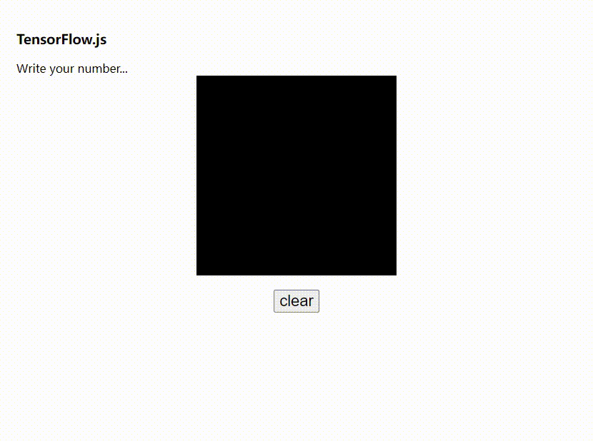

## Contents

## 前言

组里要求全员学习AI

学了一点 [Computer Vision](https://cs231n.stanford.edu/index.html) 和 [TensorFlow](https://www.tensorflow.org/js)

秉着试一试的精神，用了`tfjs`做了一个纯浏览器版本的手写数字识别

训练部分与预测部分均在浏览器端完成

## 效果

## 在线玩一下

[https://dabuside.github.io/mnist-browser/](https://dabuside.github.io/mnist-browser/)

::github{repo="dabuside/mnist-browser"}