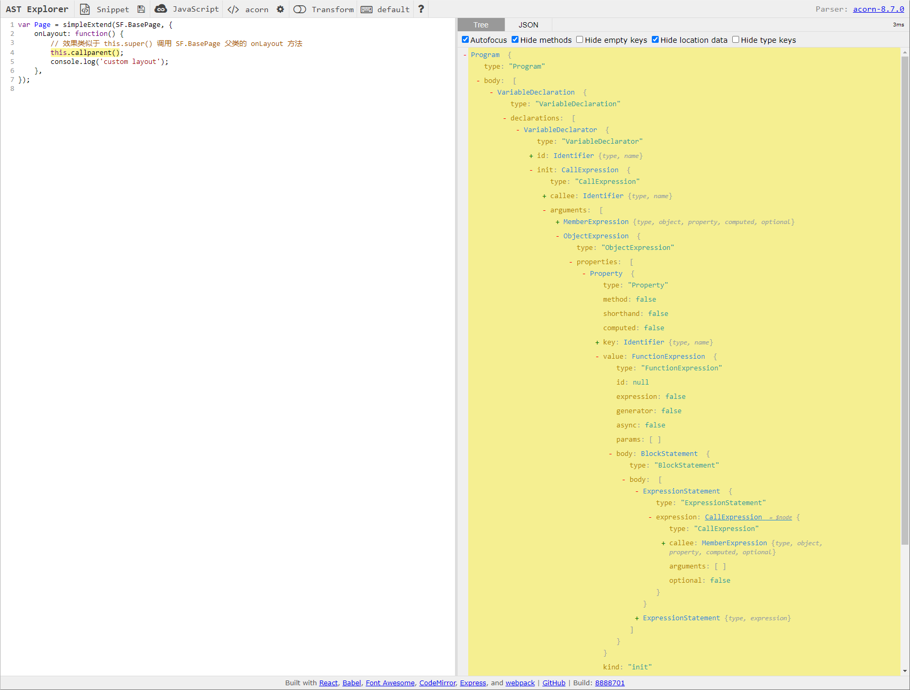
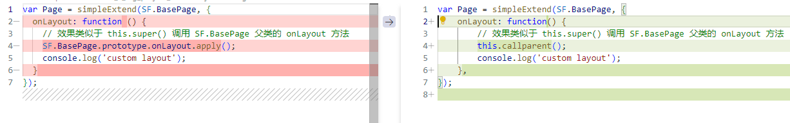
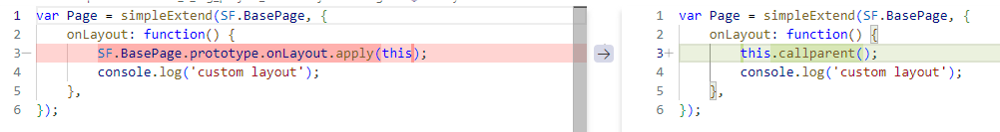

## Contents

## 大坑

接手了一个历史 10+ 年，200+ 页面路由，js 文件 3000+，css/less 文件 2000+ 的巨型后台管理系统。它的脚手架是公司内部定制的`sfx`，即深度封装的`webpack4`。他的界面是长这个样子的。


如下问题十分影响开发效率

1. 项目 dev 时间在 3-4 min，修改 js 文件的 HMR 热更新时间基本在 30s+
2. 业务框架为 Ext，新人上手成本极大，老人的开发效率也不如现代框架
3. CI 时间非常久，普遍需要 40 min
4. 由于组件库框架使用 js 实现了一套样式系统，适配不同国际化语言需要编写侵入性代码，无法做到语言配置与代码隔离

**入项一年多后，准备进行大刀阔斧的改进**

## 尝试 Webpack 调优

挂载 Webpack 性能检测 [SMP 插件](https://github.com/stephencookdev/speed-measure-webpack-plugin)，校验 dev time 各个任务的运行时间

插件统计出的各个 loader 与 plugin 的运行时间如下

> 统计插件本身会影响性能。总运行时间之和会大于总时间，因为任务是并行的

0. dev 启动总时间 4 min+
1. happypack + babel-loader + eslint-loader + vue-loader + ts-loader ~ 2~3 min (with cache)
2. css-loader + postcss-loader + less-loader + style-loader ~ 1-2 min (without cache)
3. file-loader + url-loader + svgo-loader ~ 1 min
4. progress plugin ~ 4 min（progress 插件一直在运行，故 plugin 运行时间 === 总时间）
5. sourcemap 生成没有在统计范围内，肉眼察觉在 30s

其中，js 相关 loader 处理文件 2000+，css 相关 loader 处理文件 1000+，可以明显察觉，dev 的启动瓶颈在于需要处理的文件太多了。即使有了缓存，速度仍然不理想。

> 热更新 css 文件，大多是毫秒级响应。热更新 js 文件，大多数场景所需处理的文件仅少一两个量级，有 1/3 时间消耗在 sourcemap 生成

核心问题在于 Webpack 对于懒编译支持很差。即无法按需编译。由于 200+页面路由全部都是懒加载的，完全可以访问到对应路由，再进行编译相关文件，无需提前将 200+路由页面事先编译好再启动。[webpack5.4 之后实验性支持懒编译](https://webpack.js.org/configuration/experiments/#experimentslazycompilation)

根据 [Webpack 官方调优指南](https://webpack.js.org/guides/build-performance/) 进行优化

1. 升级 Webpack 到最新版
2. 精简 loader、plugin
3. 第三方包 DLL 预编译
4. 多线程
5. 缓存
6. 去除进度插件

实验效果如下

1. 直接升级到 Webpack5 报错很多跑不动，短时间改不好，先搁置
2. 去掉了没用的 loader，提升不明显
3. sfx 已集成预编译
4. sfx 已集成多线程插件
5. sfx 已集成缓存插件，修改 css 相关文件，热更新时间很短，暂时不加
6. 有用！去除进度插件可以节约 30s 左右的启动速度，dev 速度也有对应比例提升

总体提升不明显，且热更新时间太长仍然是关键瓶颈。咨询公司内部其余采用 Webpack5 的大项目，热更新时间仍然不理想。看到 [webpack 原作者](https://github.com/sokra) 跑路去写 [turbo](https://github.com/vercel/turbo) ，以及 Vue CLI 进入维护模式，我觉得未来主流不会再是`Webpack`，面对 3-5 年后的代码量增长，编译环节增加需求，还是尽早迁移到`Vite`上比较好

## 尝试 vite

vite 使用 ESM 模块加载机制，热更新时候仅需更新少量文件，无需重新打包。且 vite 原生支持按需编译，即访问到某个页面，才会将需要的文件编译。

为了升级到 vite ，需要解决如下问题

1. ESM 所有模块均采用严格模式，原先存在很多非严格模式的用法，需要批量更新成严格模式
2. 原先代码的模块化方式是 CommonJS， 需要批量更新成 ESM
3. 他们配置文件上的差异转换，以及原先的 Webpack 插件重写成 rollup 插件

### 严格模式转换

Ext 框架是 09 年的产物，那时候还没有 ES6 继承相关的规范，为了在类之间方便创建继承关系，Ext 代码是这样描述继承的

```
var Page = simpleExtend(SF.BasePage, {
    onLayout: function() {
        // 效果类似于 this.super() 调用 SF.BasePage 父类的 onLayout 方法
        this.callparent();
        console.log('custom layout');
    },
});
```

`this.callparent`的本质是通过`Function.prototype.caller`这种[非严格模式](https://developer.mozilla.org/en-US/docs/Web/JavaScript/Reference/Global_Objects/Function/caller)的寻址，找到父类的方法名并调用。等价于`this.callparent.caller.name.apply(this, arguments)`

这种非严格模式调用，需要改成显式的对父级函数的调用，以满足严格模式（ES Modules）的要求

所以，上述代码需要转换成

```
var Page = simpleExtend(SF.BasePage, {
    onLayout: function() {
        SF.BasePage.prototype.onLayout.apply(this);
        console.log('custom layout');
    },
});
```

非严格模式继承 demo 如下

```
function simpleExtend(base, props) {
    function NewConstructor() {
        base.apply(this, arguments);
    }

    NewConstructor.prototype = Object.create(base.prototype);
    NewConstructor.prototype.constructor = NewConstructor;

    for (var prop in props) {
        if (props.hasOwnProperty(prop)) {
            NewConstructor.prototype[prop] = props[prop];
        }
    }

    NewConstructor.prototype._parent = base.prototype

    return NewConstructor;
}

var SF = {
    BasePage: (function() {
        var f = function() {}
        f.prototype.onLayout = function onLayout() {
            console.log('base page layout')
        }
        f.prototype.hello = function onLayout() {
            console.log('hello')
        }
        f.prototype.callparent = function() {
            return this._parent?.[this.callparent.caller.name].apply(this, arguments);
        }
        return f
    }
    )()
}

var Page = simpleExtend(SF.BasePage, {
    onLayout: function() {
        // SF.BasePage.prototype.onLayout.apply(this, arguments)
        this.callparent();
        console.log('custom layout')
    },

    myFunc: function() {}
})

var p = new Page();
p.onLayout();
```

还可参见[Ext 源码完整实现](https://cdn.sencha.com/ext/gpl/3.4.1.1/docs/source/Ext.html)

#### Babel 插件

现在的问题就在于，项目中 2000+ 的 js 文件几乎每个都涉及到这种非严格模式调用，靠人工肯定是不现实的。最好是写一个插件批量完成这种的转换。

其中，Babel 插件做这个最合适了。

Babel 是一个编译器，他能将代码 code 转换为另一种形式的 code。大体流程如下

```
const ast = parse(code);
const astTransformed = transform(ast);
const codeNew = generate(astTransformed);
```

我们要做的就是编写一个 AST 转换插件，他会集成到`transform`流程中，对 AST 进行修改，以达到最终效果。

`this.callParent()`在 AST 结构树中的表示如下 



我们需要

1. 找到`this.callparent()`的 AST 节点
2. 找到 Extend 继承的父类节点
3. 找到 Extend 继承的父类节点的方法
4. 根据2，3拿到的信息修改 1 节点的内容

简易示例如下

```
Identifier(path) {
    // 1. 找到`this.callparent()`的 AST 节点
    if (path.node.name === "callparent") {

        // 2. 找到 Extend 继承的父类节点
        const extendPath = path.findParent(
            (p) =>
                p.node.type === "CallExpression" &&
                p.node.callee.name === "simpleExtend",
        );
        const extendNode = extendPath.node.arguments[0];

        // 3. 找到 Extend 继承的父类节点的方法
        const methodPath = path.findParent(
            (p) => p.node.type === "ObjectProperty",
        );
        const methodString = methodPath.node.key.name;

        const extendString = `${extendNode.object.name}.${extendNode.property.name}.prototype.${methodString}.`;

        // 4. 根据 methodPath extendPath 拿到的信息修改 1 节点的内容
        path.parentPath.parentPath.replaceWithSourceString(
            `${extendString}apply(this)`,
        );
    }
}
```

[示例playground](https://astexplorer.net/#/gist/d56c1a29f344c5c6b73cf316e08a93a9/138db87532b490f063cacb23d47cb121f47ae6b5)

#### Edge Case

写这种转换插件，大约 20% 的时间是用在写最常规的流程的，其余 80% 的时间都是处理 Edge Case 的，项目只要一大，就会发现什么写法都有

父类指向不清晰

```
let grid = new Ext.extend(SF.grid.GeneralGrid, {
    initComponent: function () {
        this.portDisplayField = this._createDisplayField({
            setWidth () {
                this.callParent([0]);
            }
        });
    }
});
```

函数入参使用 Default parameters 语法，解构等语法

```
let Win = Ext.extend(SF.form.FormWindow, {
    constructor (cfg = {}) {
        cfg.form = new Form();
        this.callParent([cfg]);
    }
});
```

非赋值语句

```
new Ext.extend(ContainerCombo, {
    expand () {
        this.callParent();
        this.reload();
    },
});
```

... 太多了。

我开始能理解 eslint 规则为什么不好写了。举个例子，未声明变量提示，[代码](https://github.com/eslint/eslint/blob/main/tests/lib/rules/no-unused-vars.js)只需要 800 行，但是[测试用例](https://github.com/eslint/eslint/blob/main/lib/rules/no-unused-vars.js)足足有 1800 行

还能说啥呢，只能是一个一个加到测试用例里面，继续爬坑。

#### Recast

好不容易吧所有场景的转换都处理完，又发现一个问题。明明一个文件只修改了少了的 AST 节点内容，怎么最终生成的文件有巨大的 diff 差异？



项目中没有引用 prettier 等统一格式化工具，只有 eslint autofix。重新 eslint 排版后，仍有大量差异信息。应该是 Babel 在 generate 流程，将所有 AST 当作全新的 AST 去生成了。因为项目组里面有 20 来个人，我这 diff 差异太大的话，会给组内其他人员上库代码造成严重的冲突问题。必须要解决一下。

通过一番搜索，了解到有这样一个工具 `Recast`，它可以实现精准修改特定 AST 节点，而不影响其他节点，集成到 babel 中也特别方便。

```
import { parse, print } from "recast";
import { transformFromAstSync } from "@babel/core";
export function babelRecast(code) {
  const ast = parse(code, { parser: require("recast/parsers/babel") });
  const options = { plugins: [updateContent] };
  const { ast: transformedAST } = transformFromAstSync(ast, code, options);
  const result = print(transformedAST).code;
  return result;
}
```

Recast 的原理就是对比修改前后的 AST 节点信息，找到被修改的 AST 节点，再进行精准修改。

而 Babel 则是直接根据修改后的 AST 节点（丢弃 loc 位置信息）重新生成代码。

最终的效果如下



### CommonJS 批量转 ESM

由于 CommonJS 的导入导出语法比上述场景多得多，自己短时间内完整实现一套 AST 转换不现实。且市面上有很多 CJS 转 ESM 的工具，秉着不造轮子的理念，逐一尝试了 star 较多或者 npm download 数量较大的开源方案

- https://github.com/lebab/lebab
- https://github.com/5to6/5to6-codemod
- https://github.com/wessberg/cjstoesm
- https://github.com/tnfe/wp2vite
- https://www.npmjs.com/package/@rollup/plugin-commonjs

但是没有一个能完美解决项目里面的场景的。甚至不少开源转换方案，在最基本的导入导出场景都错误处理。

#### 模块导入导出的关键差异

最主要的问题在于`require`相关的语法是**运行时**决定哪些模块导入导出的，而`import`相关语法是**编译时**决定哪些模块导入导出的。

举个例子，模块 A 使用 CJS 语法声明了一个导出对象 obj

```
var obj = {
	foo() {
		return 2 + 2;
	},
	bar: 3,
	baz: new RegExp("")
};
module.exports = obj;
```

模块 B 中这些 CJS 导入都是合法的，即便没有显式声明这部分导出，因为这部分是运行时的函数调用而已

```
var pkg = require('b.js');
var { foo } = require('b.js');
```

若上述导出代码转换为 ESM，则应为

```
export function foo() {
	return 2 + 2;
}
export const bar = 3;
export const baz = new RegExp("");
export default { foo, bar, baz };
```

即如何处理导出模块，与导入上使用的语法关系相当大。为了兼容*大部分*导入场景，导出部分需要显式声明

1. 每个子模块导出的内容，即`export const xxx`
2. 默认导出的内容，即`export default xxx`

且导入语法不能有多级解构

如
```
const {
  a: { b: c },
} = require("b.js");
```

没有对于的 ESM 导入语法支持，只能处理成默认导出，并额外增加赋值语句
```
import bMod from 'b.js';
const {
  a: { b: c },
} = bMod;
```

#### 过于高级的语法

由于项目中使用了一些 Stage 3 Proposal 的语法，如`??`,`?.`，导致很多转换器在解析环节生成 AST 就出错了，必须 fork 项目，进入源码，升级解析器才能支持将代码处理成 AST 节点树


#### Edge Case

```
// condition import
const img = isEnglish ? require('img_en.jpg') ? : require('img_cn.jpg');
```

```
// unnamed import
const imgs = [require('1.jpg'), require('2.jpg'), require('3.jpg')];
```

```
// direct import call
require('method.js')();
```

```
// dynamic export
var obj = {
    b: 20
};
module.exports = {
    ...obj,
    a,
};
```

#### 处理方式

优先选择采用 jscodeshift 方案的代码。因为他们一般都有插件化，可以单独启用禁用某种转换逻辑。这样一种语法一种语法转换，不容易出错。每个开源方案都是部分正确的，需要吧正确的部分找出来，屏蔽错误的部分。再编码开源方案未解决的部分

由于该部分的语法以及边界场景比上述严格模式转换要多得多，即使在有很多开源产品的帮助下，完成转换仍然花费了数倍与上述严格模式转换的时间

## 最终效果

- 热启动时间 30s
- HMR 时间 1s 内