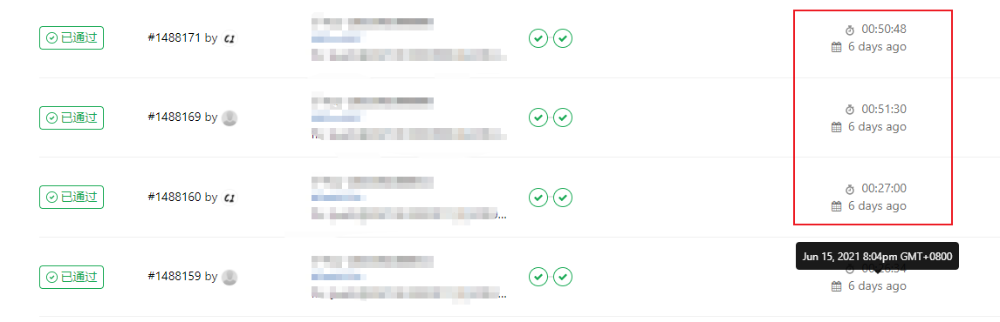
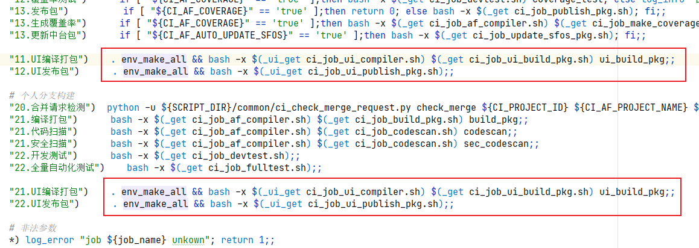
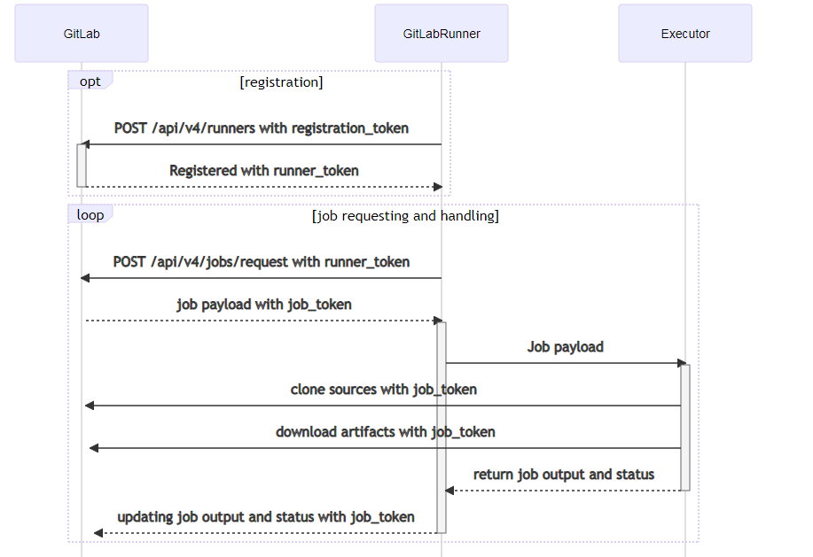
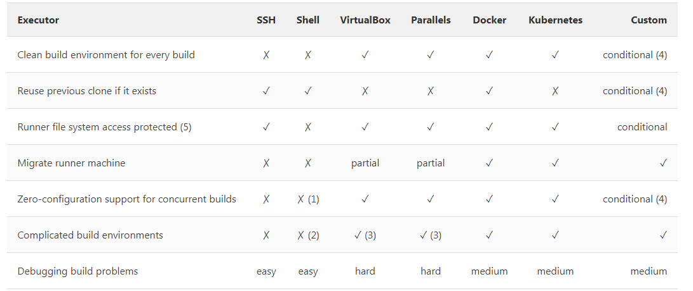
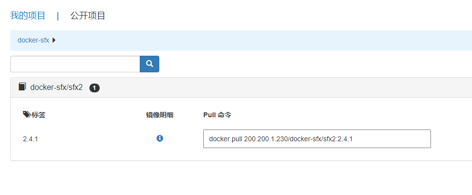
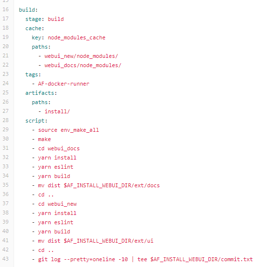
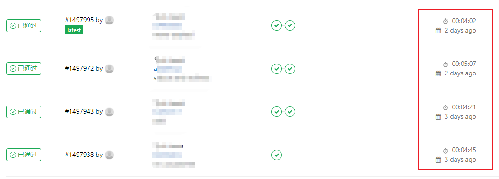

## Contents

## 历史问题

前后端没有分仓库管理的时候，前后端代码在同一个仓库内，且前后端构建在一个脚本内，由后端维护。

现在前端仓库从后端代码仓独立之后，后端不太管这一块。出问题需要自行排查解决。遗留问题老大难了。

原先的构建代码有 1000+ 行，而且还是以`makefile`脚本写的，前端没人看得懂。。

> CI实在卡的不行，一次少说 30 分钟。

> 原有CI流程也太多了

## 梳理

经过痛苦的 `makefile` 学习之后，我发现卡的原因在于

- 在打包脚本里面写安装软件，跑CI都需要安装`node`,`git`,`yarn`等软件
- CI是在 `shell runner` 中执行的，而不是 `docker runner`

> 怎么破局

1. 对于前端构建来说哪些流程是必要的？===>构建、上传代码
2. 构建脚本中软件安装流程能否省略？===>迁移至docker image内
3. 代码可读性不佳，如何优化？===>重构、提供完整的文档

## docker 简介

### 什么是docker？

The Docker daemon（dockerd） docker服务端。主要功能是管理image container network等

The Docker client（docker） Docker前端。大部分用户通过docker前端来操作docker。主要功能是和dockerd通讯。

Docker registries 类似git，提供pull push commit tag等功能。主要是对docker image进行版本管理。

Images 只读模板，类似虚拟机镜像（win7+ie8;win7+ie10）

Containers 是 image 的可运行实例。

### 什么是 gitlab runner？ 

Runner是 gitlab ci cd 工作流钦定的执行套件。 

### 不同 executor 有什么区别

## 改造

### 制作前端构建环境 docker 镜像

俺们吧所需的全部软件，安装到 docker 镜像里面，写成 docker file

再上传到公司的 docker harbor 镜像仓库

### 注册 docker gitlab runner 到项目

### 迁移 1000+ 行 makefile 构建到 node script

## 最终效果

CI 流水线平均用时缩短 90%

